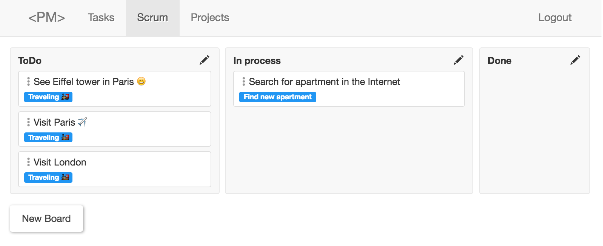
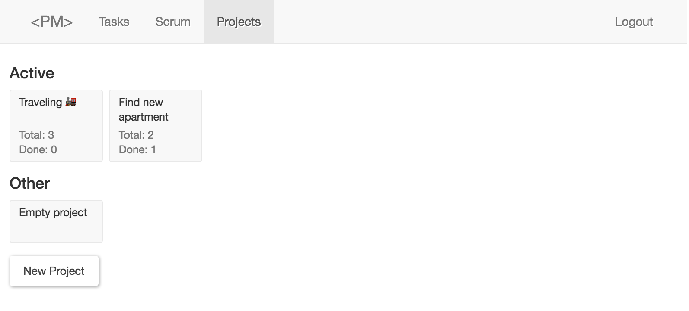
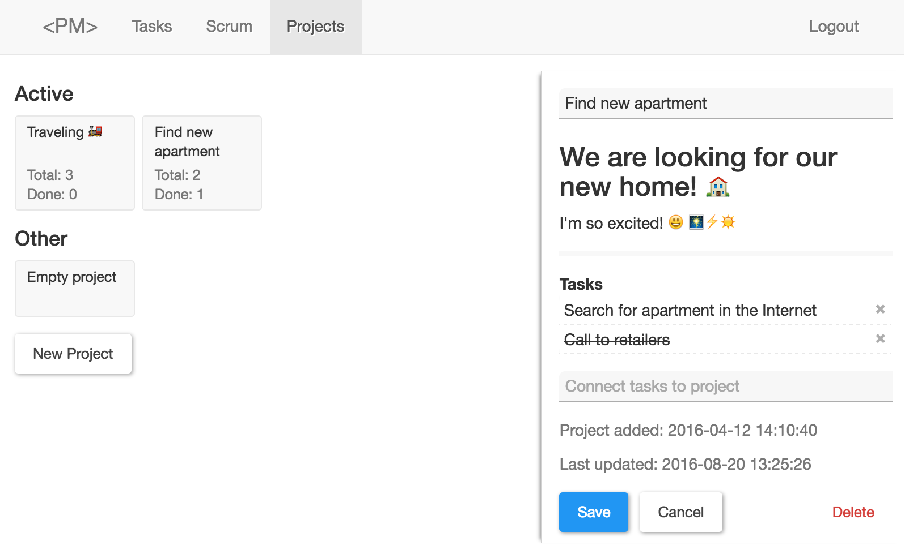

[Русская версия](readme-ru.md)

# Project Management App

Open Source Project Management app.

Work in progress. There is still much to be done.


---

---

---


## Getting started

I assume that you have at least `node v4.x.x` and `npm 3.x.x`.

First of all you need to run following command:
(it will install all dependencies and copy all needed files after that)

```
$ npm i && npm run build
```

Then run the server:

```
$ npm start
```

And start watching files:

```
$ npm run watch
```

This is it, you are ready to go - open [http://localhost:8000/login](http://localhost:8000/login) and login with test user:

Email: `test@test.com`<br>
Password: `test`

Alternatively you can open [http://localhost:8000/signup](http://localhost:8000/signup) and create your first user.

[All npm commands](docs/npm.md)

## e2e tests

Download the latest version of selenium server and chromedriver (which will be needed for running tests in Chrome browser)

```
$ npm run e2e-setup
```

Run e2e tests

```
$ npm test
```

More [about e2e tests](docs/e2e.md)

## Main technologies

* ReactJS - https://facebook.github.io/react/
* Redux - http://redux.js.org/
* Bootstrap css - http://getbootstrap.com/
* Hapi.js - http://hapijs.com/
* Webpack - https://webpack.github.io/
* Nightwatch - http://nightwatchjs.org/
* Gulp - http://gulpjs.com/
* Less - http://lesscss.org/
* Babel - https://babeljs.io/ 

## 3rd party packages

* markdown-it - https://github.com/markdown-it/markdown-it
* moment - https://www.npmjs.com/package/moment
* flatpickr - https://chmln.github.io/flatpickr/

## Compilation

I'm using webpack with some plugins


