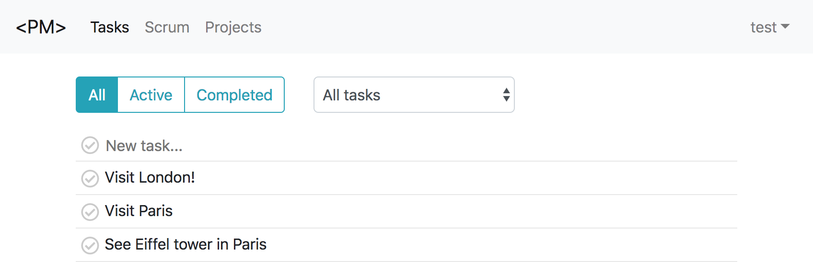

# Project Management App

Open Source Project Management app.

Work in progress. There is still much to be done.


---

---

---


## Getting started

I assume that you have at least `node v9.x.x` and `npm 5.x.x`.
(Everything tested in following environment: `node v9.3.0` and `npm 5.6.0`)

*Start server*

```
$ cd server/ && npm start 
```

*Start watch for the app*

```
$ cd app/ && npm start 
```

This is it, you are ready to go - open [http://localhost:8080/login](http://localhost:8080/login) and login with test user:

Email: `test@test.com`<br>
Password: `test`

Alternatively you can open [http://localhost:8080/signup](http://localhost:8080/signup) and create your first user.

[All npm commands](docs/npm.md)

## Tests

You need to run tests separatly for server and for client

```
$ npm test
```

## Swagger

* http://localhost:3000/api/docs/
* http://localhost:3000/api/api-docs


